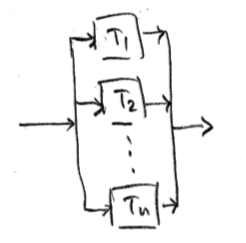
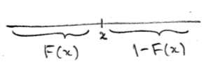
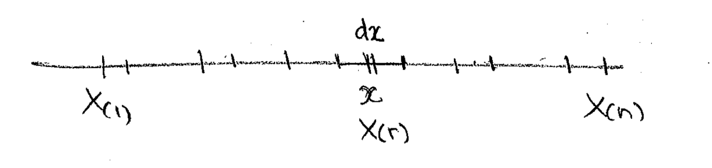
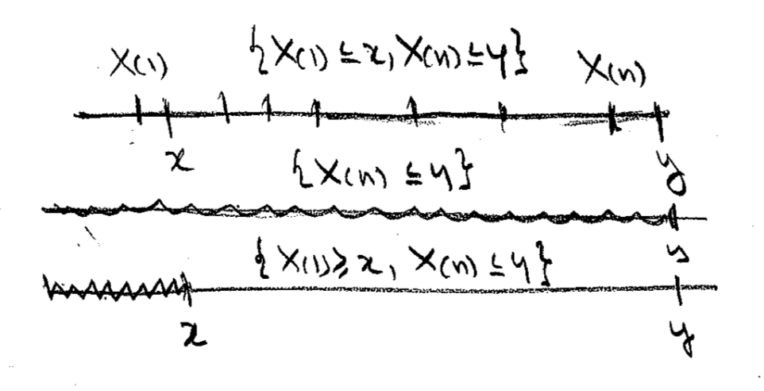

```{r setup, include=FALSE}
library(knitr)
library(tidyverse)
library(kableExtra)

knitr::opts_chunk$set(echo = TRUE)
```

<!-- Deficiniciones en latex del capitulo -->
\newcommand{\derx}{\mathfrak{d}x}
\newcommand{\der}{\mathfrak{d}}
\newcommand{\igualind}{\stackrel{\mbox{ind}}{=}}
\newcommand{\xvect}{\underline{\mathbf{\small{X}}}


# Estadísticos de Orden {#estord}


## Definiciones

En estadística, uno se refiere a una **muestra aleatoria** de tamaño $n$ de una población $\texttt{X}$ con función de densidad de probabilidad (fdp) $f$, a una colección $x_1, \ldots, x_n$ de variables aleatorias independientes e identicamente distribuidos con fdp común $f$. Así, $\underline{\mathbf{x}} = (x_1, \ldots, x_n) \; \text{m.a. de }\;x \sim f.$

\vspace{.5cm}

Un **estadístico** es una función de la m.a. que no depende de parámetros desconocidos. Por ejemplo, sea $\underline{\mathbf{x}} = (x_1, \ldots, x_n) \; \text{m.a.}$, $\overline{\mathbf{x}} = \frac{1}{n} \sum_1^n x_i$; $\mathbf{s^2} = \sum_1^n (x_i - \overline{\mathbf{x}})^2$; $\mathbf{x}_m = \texttt{min}\{x_1, \ldots, x_n\}$; $\tilde{\mathbf{x}} = \texttt{mediana}\{x_1, \ldots, x_n\}$; $\mathbf{x}_M = \texttt{max}\{x_1, \ldots, x_n\}$. Por otro lado, $\sum_1^n(x_i - \mu)^2$ no es un estadístico pues depende de $\mu$, parámetro desconocido. 

\vspace{.5cm}

Sea $\underline{\mathbf{x}} = (x_1, \ldots, x_n)$ m.a. de $x \sim f$, las $x_1, \ldots, x_n$ son $\texttt{vaiid}$. Se definen los **estadísticos de orden** de la m.a. $\mathbf{x}$ por: $x_{(1)}, \ldots, x_{(n)}$, tales que, para todo $\omega   \; \epsilon  \; \Omega$ $x_{(1)}(\omega) \leq x_{(2)}(\omega) \leq\ldots \leq x_{(n)(\omega)}$. Si ${Y_i} = x_{(i)} \; i = 1, \ldots, n$, entonces, para todo $\omega   \; \epsilon  \; \Omega$

$$
\begin{array}{ccl}
{Y_1}(\omega) & = & \texttt{min}\{x_1(\omega), \ldots, x_2(\omega)\}\\
{Y_2}(\omega) & = & \text{la segunda realización} \; x_i(\omega) \; \text{más pequeña}\\
\vdots && \\
{Y_r}(\omega) & = & \text{es tal que} \; Y_i(\omega) \leq \ldots \leq Y_{r-1}(\omega) \leq Y_{r}(\omega) \leq \ldots \leq Y_{n}(\omega)  \\
\vdots && \\
{Y_1}(\omega) & = & \texttt{max}\{x_1(\omega), \ldots, x_2(\omega)\}\\
\end{array}
$$

$$
\begin{array}{ccl}
{x_{(1)}} & = & \text{primer estadístico de orden}\\
\vdots & & \\
{x_{(r)}} & = & \text{r-ésimo estadístico de orden}.
\end{array}
$$

Se define el rando de una m.a. $\underline{\mathbf{x}}$ como 

$$
R = x_{(n)} - x_{(1)} = \texttt{max}\{x_i\}-\texttt{min}\{x_i\}
$$

Consideraremos v.a. continuas, de tal manera que con probabilidad 1 no se tienen empates, luego, 

$$
x_{(1)} < x_{(2)} < \ldots x_{(n)}.
$$


\vspace{1cm}

## Ejemplos 


### Mecanismo de componentes

**Ej:** Considere un mecanismo con $n$ componentes idénticos e independientes con tiempos de vida $T_1, \ldots, T_n$. 

a) Si los componentes están conectadas en **serie**,

```{r ejserie, out.width='200pt', fig.pos='H', fig.align='center', echo = F}
knitr::include_graphics("imgs/estadord_ej_compserie.png")
```
Entonces, $T_{(1)} = \texttt{min}\{T_1, \ldots, T_n\}$ es el tiempo de operación del mecanismo.

b) Si los componentes están conectadas en **paralelo**,

```{r ejparalelo, out.width='100pt', fig.pos='H', fig.align='center', echo = F}

```
Entonces, $T_{(n)} = \texttt{max}\{T_1, \ldots, T_n\}$ sería el tiempo de operación del mecanismo.


### Línea de producción de partes

**Ej:**  Suponga una línea de producción de partes (tornillos) supuestamente idénticos. Sean $x_1, \ldots, x_n$ las longitudes de los tornillos. Si $x_{(1)}$ y $x_{(n)}$ están dentro de tolerancia, **todos** los tornillos. 

Note que $R = \texttt{max}\{x_i\} - \texttt{min}\{x_i\} = x_{(n)}- x_{(1)}$ es una medida de la variación (variabilidad de la producción).


### Máximos y mínimos de 12 muestras de distribución $\texttt{Unif} (0,1)$

```{r maxminmuestras_1, fig.height=6, fig.width=10}
N <- 12
n <- 8
k <- 3

col <- seq(2,n+1)
x <- matrix(NA,nrow=N,ncol=n,dimnames=list(seq(N),paste("x",seq(n),sep="")))
xmin <- rep(NA,N)
xmax <- rep(NA,N)
idxm <- rep(NA,N)
idxM <- rep(NA,N)
for(i in seq(N)) {
    x[i,] <- runif(n)
    xmin[i] <- min(x[i,])
    idxm[i] <- which.min(x[i,])
    xmax[i] <- max(x[i,])
    idxM[i] <- which.max(x[i,])
}
lab <- paste("Máximos y mínimos de",N,"muestras de tamaño",n,
    "\n de una poblacion (distribucion) uniforme (0,1)")
# cat(paste(lab,"\n"))
tab <- t(round(x <- cbind(x,xmin=xmin,xmax=xmax,rango=xmax-xmin),3))

opar <- par(no.readonly=TRUE)
par(mfrow=c(1,1),mgp=c(1.5,.5,0),mar=c(3,3,3,4),oma=0*c(1,1,1,1),pty="m")
ylim <- c(0,1)  # range(xmin,xmax)
plot(0,0,xlim=c(1,N),ylim=ylim,type="n",
    xlab="ensayo (muestra)",ylab="realizaciones",
    main=lab,cex.main=0.9)
rect(k-0.5,-0.03,k+0.5,1.03,col=grey(.98),border=1)
for(i in seq(N)) {
    points(rep(i,n),x[i,seq(n)],pch=20,col=col)
    points(rep(i,2),c(xmin[i],xmax[i]),pch=c(25,24),col=1,cex=1.25)
}
axis(4,labels=FALSE)
points(jitter(rep(N+1,N)),xmin,col=col[idxm],pch=25,xpd=NA,)
points(jitter(rep(N+1,N)),xmax,col=col[idxM],pch=24,xpd=NA)
```

Las observaciones de cada muestra se muestran a continuación:
```{r echo = F}
tab %>% 
  as_tibble() %>% 
  rename_all(function(col){
    paste("M", parse_number(col))
  }) %>% 
  rownames_to_column(var = "Obs") %>% 
  mutate(Obs = rownames(tab)) %>% 
  knitr::kable(digits = 3, align = 'c', row.names = F, format = 'latex') 
```

### Muestras de distribución $\texttt{Gamma} (\alpha = 1, \beta = 1)$

```{r distgamma, fig.height=8, fig.width=10}
ev <- function (x) return(eval(parse(text = x)))

N <- 2000        # Numero de simulaciones
n <- m <- 21    # taman~o de muestra

k <- 5     # estadistico de orden desead
if(k < 1 | k > n) stop("\n*Estadístico de orden fuera de rango!")

x <- rep(NA,N)

#   Leyes de Probabilidad
# 1 = binomial
# 2 = poisson
# 3 = uniforme
# 4 = normal
# 5 = gamma
ley <- 5
ley <- ifelse(ley == c(1,2,3,4,5),1,0)

if(ley[5]) {
LeyProb <-  "Distribución Gamma"
alpha <- 1  
beta <- 1
mx=2
mtitle <- substitute("parámetros: "*Alpha*"="*alpha*", "*Beta*" ="*beta,
            list(Alpha=quote(alpha),alpha=alpha,Beta=quote(beta),beta=beta))
leyProb <- "rgamma(n,alpha,beta)"

for(i in seq(N)) x[i] <- sort(ev(leyProb))[k]
}

opar <- par(no.readonly=TRUE)
par(mfrow=c(1,2),mar=c(4,4,2,1),mgp=c(2,.5,0),oma=c(2,0,2,0),pty="s",
    cex=1,cex.axis=0.8,las=1)

n <- N
xlab <- "x"
mlab <- paste("distribución poblacional")
y <- ev(leyProb)
xlim <- range(y)
hist(y,probability=TRUE,xlim=xlim,
    border="white",col="bisque",
    xlab=xlab,ylab="densidad",main=mlab,cex.main=0.8)
if(which(ley==1)>2) lines(density(y),xlim=xlim,lwd=2,col="coral4")
points(y <- sample(y,m),rep(0,m), pch=20, cex=1)
points(sort(y)[k],0, pch=20, cex=1, col=2)

xlab <- expression(x[(k)])
mlab <- paste("k=",k," estadístico de orden",sep="")
hist(x,probability=TRUE,xlim=xlim,
    border="white",col="burlywood4",
    xlab=xlab,ylab="densidad",main=mlab,cex.main=0.8)
if(which(ley==1)>2) lines(density(x),xlim=xlim,lwd=2,col="coral4")

title(LeyProb,line=1,outer=TRUE)
title(mtitle,cex.main=0.9,line=0,outer=TRUE)
title(paste("Número de muestras simuladas:",N),cex.main=0.9,line=-2,outer=TRUE)
title(paste("Tamaño de muestra:",m),cex.main=0.8,line=-3,outer=TRUE)
```


### Muestras de distribución $\texttt{Normal}(\mu, \sigma)$

```{r estordnormal, fig.width=8, fig.height=4}
N <- 5000
n <- 25
k <- 5

mu <- 10
sigma <- 2

xm <- rep(NA, N)
xM <- rep(NA, N)
xq <- rep(NA, N)

X <- matrix(NA,nrow=N, ncol=n)
for(i in seq(N)) {
  x <- rnorm(n, mean=mu, sd=sigma)
  xm[i] <- min(x)
  xM[i] <- max(x)
  xq[i] <- sort(x)[k]
  X[i,] <- x
}
xlim <- range(X)

opar <- par(no.readonly=TRUE)
par(mfrow=c(1,1), mgp=c(1.5,.5,0), mar=c(4,3,2,1), oma=c(0,0,0,0), pty="m", las=1, 
    cex=1.00, cex.lab=0.9, cex.main=1.0, cex.axis=0.9)
col.null <- "lightgreen"
col.m <- "red"
col.M <- "blue"
col.k <- grey(.7)

X <- rnorm(2*N, mean=mu, sd=sigma)
tt0 <- hist(X, plot=FALSE)
plot(tt0, xlim=xlim, axes=FALSE, xlab="", ylab="", main="", 
     col=col.null, border=col.null, density=20, angle=-45)
tt <- hist(xm, plot=FALSE)
plot(tt, add=TRUE, col=col.m, border=col.m, density=20, angle=30)
tt <- hist(xM, plot=FALSE)
plot(tt, add=TRUE, col=col.M, border=col.M, density=20, angle=-30)
tt <- hist(xq, plot=FALSE)
plot(tt, add=TRUE, col=col.k, density=25, angle=45)
qlab <- paste(k,"-ésimo",sep="")
lab <- c("Estadístico", "original", "mínimo", "máximo", qlab)
legend("topleft", col=c(0, col.null, col.m, col.M, col.k), lwd=4, legend=lab, bty="n")
lab <- paste(N,"muestras de tamaño", n)
title("Distribución normal", sub=lab, line=1)
```


## Función de densidad

Sea $\underline{\mathbf{x}} = (x_1, \ldots, x_2)$ m.a. de $X$ con fpa $F$ y fdp $f$. 

Sea $x \epsilon \mathbb{R}$, la probabilidad de que exactamente $r$ de los $x_i$'s hayan caido en $(-\infty, x]$ y $(n-r)$ en $(x, \infty)$ es

$$
{n\choose r} F(x)^r \big[1 - F(x)\big]^{n-r}
$$
gráficamente, 
```{r probanr, out.width='250pt', fig.pos='H', fig.align='center', echo = F}

```


El evento $\{X_{(r)} \leq x\}$ ocurre si y solo si $r$ o más de los $x_i$'s caen en $(-\infty, x]$. Entonces, si $F_r \equiv  F_{x_{(r)}}$, 

$$
F_r (x) = P(X_{(r)} \leq x) = \sum_{k=r}^n {n\choose k} F(x)^k \big[1-F(x)\big]^{n-k} \quad x\; \epsilon \;\mathbb{R}.
$$

Por ejemplo:
$$
\begin{array}{ccl}
F_n(x) & = &  F(x)^n\\
F_1(x) & = &  1- \big(1-F(x)\big)^n
\end{array}
$$

Alternativamente,

$$
\begin{array}{ccccl}
F_n(x) & = &  P\big( x_{(n)} \leq x \big) & = & P\big( \texttt{max}\{x_i\} \leq x\big)  \\
 &  &   & = & P\big( x_1 \leq x, \ldots, x_n \leq x \big)  \\
 &  &   & \stackrel{\mbox{ind}}{=} & P\big( x_1 \leq x \big) \cdots P\big( x_n \leq x \big) \\
 &  &   & = & F(x)^n \\
 &  &   &  &  \\
 F_1(x) & = &  P\big( x_{(1)} \leq x \big) & = & 1- P\big( x_{(1)} \geq x\big)  \\
 &  &   & = &  1-P\big( \texttt{min}\{x_i\} \geq x\big)  \\
 &  &   & = & 1 - P\big( x_1 \geq x, \ldots, x_n \geq x \big)  \\
 &  &   & \stackrel{\mbox{ind}}{=} & 1- \Big[P\big( X \geq x \big)\Big]^n  \\
 &  &   & \stackrel{\mbox{ind}}{=} & 1- \Big[  1 - F(x)\Big]^n 
\end{array}
$$

Las correspondientes fdp:

$$
\begin{array}{ccccl}
f_n(x) & = &  \frac{\mathfrak{d}}{\derx}F_n(x) & = & n\big[ F(x) \big]^{n-1}f(x)\\
f_1(x) & = &  \frac{\mathfrak{d}}{\derx}F_1(x) & = & n\big[ 1- F(x)\big]^{n-1}f(x)  \\
\end{array}
$$
donde $\quad x \epsilon \mathbb{R}$.


Y para $1 \leq r \leq n$, se tiene 
 
a) HP \& S (1971)

$$
f_r(x)  =   
\frac{\mathfrak{d}}{\derx}F_r(x)  = 
\sum_{k =r}^n {n \choose k} 
\Big\{   
k \; F(x)^{k-1} \big[ 1 - F(x)\big]^{n-k}f(x) - (n-k)f(x)F(x)^k \big[ 1 - F(x)\big]^{n-k-1}
\Big\}
$$
con un poco de manipulación algebraíca, acomodando índices
$$
f_r(x)  =   
n {n-1 \choose r-1} 
f(x) F(x)^{r-1} \big[ 1 - F(x)\big]^{n-r} \quad ,\; x \; \epsilon \; \mathbb{R}
$$


b) B \& H (2014)

```{r ejembh, out.width='300pt', fig.pos='H', fig.align='center', echo = F}

```


Considere $\derx$ la diferencial alrededor de $x$ y $f_r$ la fdp de $X_{(r)}$. Luego $f_r(d)\derx$ es la probabilidad de que el $r$-ésimo estadístico de orden $X_{(r)}$ caiga en el intervalo de longitud $\derx$ alrededor del punto $x$. Entonces,


$$
f_r(x)\derx  = 
\underbrace{ {n-1 \choose r-1} F(x)^{r-1} }_{ \Large{ \texttt{(1)}} } \;\cdot\;
\underbrace{ nf(x)\derx }_{ \Large{\texttt{(2)}} } \;\cdot\;
\underbrace{ \big[1 - F(x)\big]^{n-r} }_{ \Large{\texttt{(3)}} } 
$$


- $\large{ \texttt{(1)} }$ Se elijen los $(r-1)$ $X_i$'s de (n-1) posibles que caerñan a la izquierda de $x$. $F(x)$ es la probabilidad de caer ea la izquierda de $x$.

- $\large{ \texttt{(2)}}$ Se elije $X_i$ de los $n$ posibles y $f(x)\derx$ es la probabilidad de que caiga en el intervalo $\derx$ al rededor de $x$.

- $\large{ \texttt{(3)}}$ Es la probabilidad de que los $(n-r)$ $X_i$'s restantes que caigan a la derecha de $x$.


\vspace{1cm}
y cancelando $\derx$ de ambos lados se tiene el resultado, 

$$
f_r(x) \derx  = 
n {n-1 \choose r-1} f(x) F(x)^{r-1}
\big[1 - F(x)\big]^{n-r} 
\;\quad\; x \; \epsilon \; \mathbb{R}.
$$

Considere ahora el rango de la muestra $R = X_{(n)} - X_{(1)}$. Para determinad la fdp de $R$ se requiere la conjunta de $X_{(1)}$ y $X_{(n)}$. Para esto, sean $x \leq y$

$$
\begin{array}{ccl}
P(X_{(1)} > x, X_{(n)} \leq y) & = & P(x < X_{1} \leq y, \ldots,  x < X_{n} \leq y) \\
 & \igualind & \big[ P(x < X \leq y ) \big]^n  \\
 & = & \big[ F(y) - F(x) \big]^n  \\
\end{array}
$$
\vspace{.5cm}

```{r fdprango, out.width='370pt', fig.pos='H', echo=FALSE, fig.align='center'}

```

Luego, 

$$
\begin{array}{ccl}
F_{1,n}(x,y) & = & P(X_{(1)} \leq x, X_{n} \leq y) \\
  & = & P \big(X_{n} \leq y\big) -  P \big(X_{(1)} \geq x,  X_{n} \leq y \big) \\
  & = & \big[F(x)\big]^n -  \big[F(y)-F(x)\big]^n \\
\end{array}
$$

Donde,

$$
f_{1,n}(x,y) =
\frac{\mathfrak{d}^2 F_{1,n}(x,y)}{\mathfrak{d}x\mathfrak{d}y} =
n(n-1)f(x)f(y)\big[F(y) - F(x)\big]^{n-2}
$$

Entonces, para $r>0$

$$
f_{\small{R} }(r) = 
\int_{\mathbb{R}} f_{1,n} (u, u+r) \der u = 
n(n-1)\int_{-\infty}^{\infty} f(u) f(u+r)
\big[ F(r+u) - F(u)\big]^{n-2}\der u
$$

## Función de densidad conjunta de los estadísticos de orden


Sea $\underline{\mathbf{x}} = (x_1, \ldots, x_n)$ m.a. de $X \sim f$. Entonces, la fdp conjunta de $\underline{\mathbf{x}}$ es 

$$
f_{\underline{\mathbf{\small{X}}} } (x) = \prod_{1 = 1}^n f(x_i) \quad\; \text{por independencia}
$$

Sea $Y_i = X_{(i)}$ el i-ésimo estadístico de orden, donde $i = 1, \ldots, n$. Entonces
$\underline{\mathbf{X}} \rightarrow  \underline{\mathbf{Y}}$ es una mera permutación de las entradas de $\underline{\mathbf{X}}$.

Por ejemplo, si $\xvect = (X_1, X_2, X_3)$

Para la permutación particular $\underline{\mathbf{X}} \rightarrow  \underline{\mathbf{Y}} = (X_2 < X_1 > X_3)$ , se tiene la transformación


